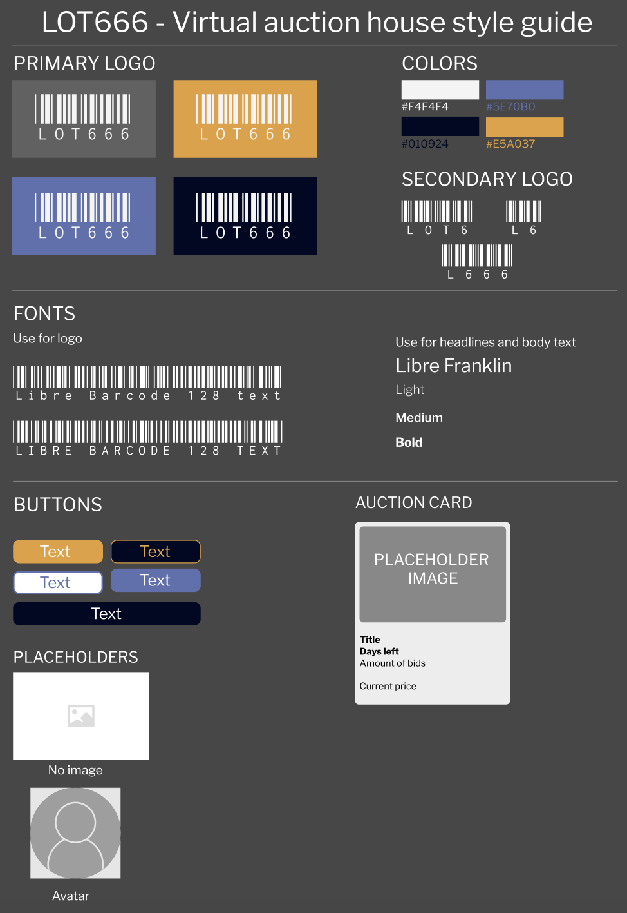

# SP2 Autumn 2023

Virtual auction house for Noroff FED autumn 2023.
This is a school project.

This repo has gone through a lot of deletions and remakes due to some unfixable bugs
encountered during the creation.

## Table of Contents

- [Getting Started](#getting-started)
  - [Prerequisites](#prerequisites)
  - [Installation](#installation)
- [Usage](#usage)
- [Linting and Formatting](#linting-and-formatting)
- [Style Guide and Prototype](#style-guide-and-prototype)
- [Contributing](#contributing)
- [License](#license)

## Getting Started

### Prerequisites

Before you begin, ensure you have met the following requirements:

- [Node.js](https://nodejs.org/) installed
- [npm](https://www.npmjs.com/) (comes with Node.js)

### Installation

1. Clone the repository:

   ```git clone https://github.com/Psijii/sp2_f23_v5```

2. Install Bootstrap and Sass:

    ```npm install bootstrap sass --save-dev```

This command installs Bootstrap and Sass as development dependencies.

## Linting and Formatting
### ESLint and Prettier

Linting and formatting are set up using ESLint and Prettier. Before each commit, Husky runs ESLint and Prettier on staged files. To manually run linting and formatting:
```npm run lint```

### Prettier

To format files using Prettier:
```npm run format```

To check formatting without modifying files:

```npm run check-format```

# Style Guide and Prototype

### Style Guide



Include a brief description or instructions for the style guide.

### Prototype


Include a brief description or instructions for the prototype.

### Project Management

  
- [Kanban/Trello Board](https://trello.com/invite/b/XagqUJF7/ATTIb43b60797717793b060fd76cf4a64035E3B66751/sp2-autumn-2023) 

# Contributing

Contributions are welcome! Follow these steps:

    Fork the project.
    Create a new branch: git checkout -b feature/new-feature.
    Commit your changes: git commit -m 'Add new feature'.
    Push to the branch: git push origin feature/new-feature.
    Open a pull request.